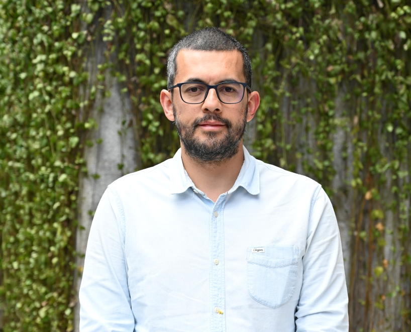
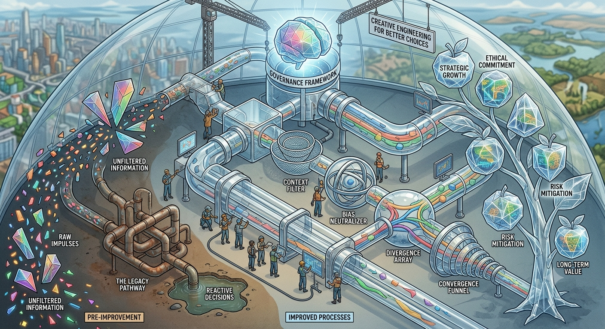
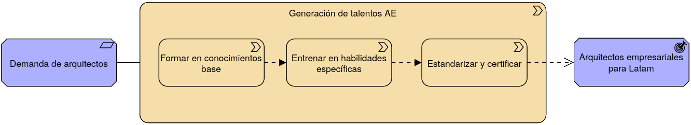
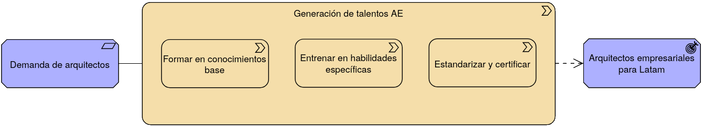
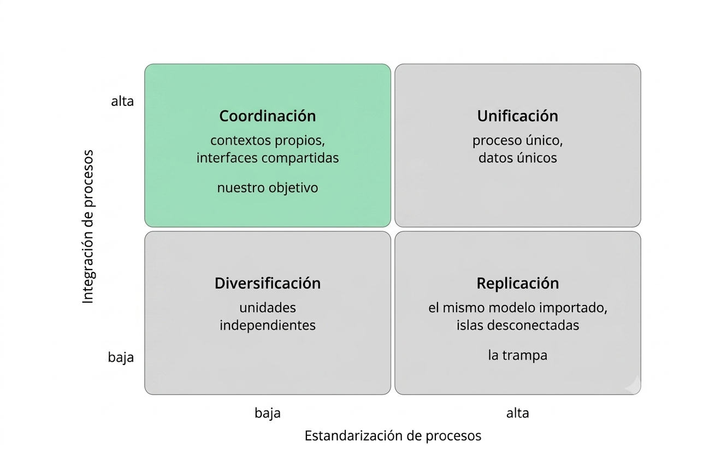
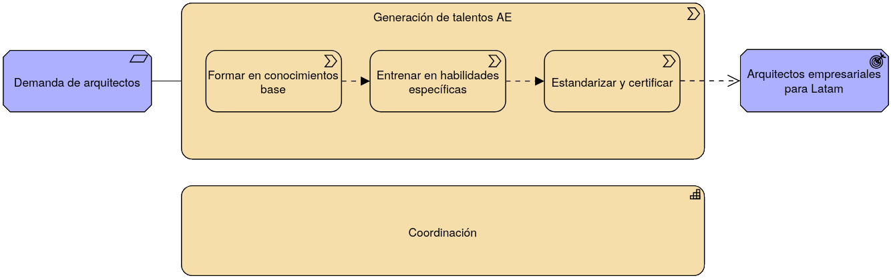
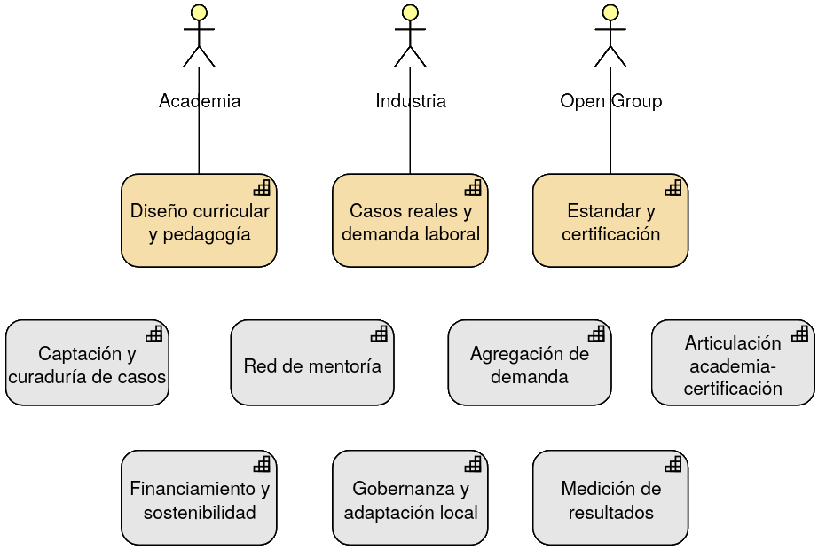
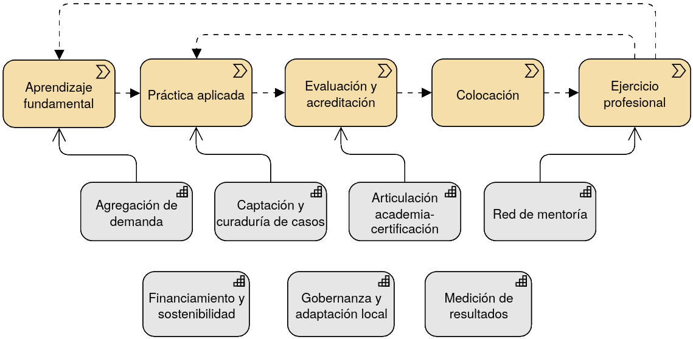
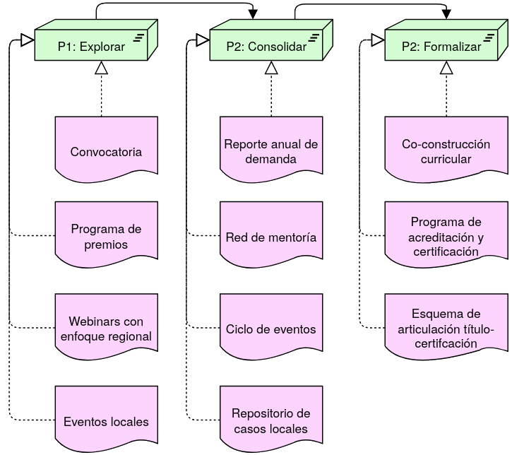

#+setupfile: https://raw.githubusercontent.com/baracunatana/org-export-common/refs/heads/main/puj-re-reveal.org

#+title: Scaling Enterprise Architecture in Latin America ​
#+subtitle: A Collaborative Agenda for Academia, Industry, and The Open Group ​

# A continuación se configura el bloque de información de autor para casos individuales (un autor). Si se quiere un bloque de autor más complejo que esto, se debe redefinir el keyword reveal_title_slide
#+author: Juan E. Gómez-Morantes, PhD
# reveal_academic_title se usa para el cargo o, en general, la linea bajo el autor. Se puede dejar vacía. 
#+reveal_academic_title: Profesor Asociado
# +reveal_miscinfo se usa para la tercera línea luego del nombre del autor. Tiene una fuente un poco más pequeña que reveal_academic_title
#+reveal_miscinfo: Pontificia Universidad Javierana
# Para cambiar el "Facultad de Ingeniería", es necesario modificar reveal_title_slide más abajo en esta plantilla
#+email: je.gomezm@javeriana.edu.co

# Se pueden dejar vacíos, pero no se puede eliminar
#+macro: lugar Quito, Ecuador • 
#+macro: contexto  Architecting the Digital Future.
#+date: {{{contexto}}} @@html:  @@ {{{lugar}}} 28 de Julio 2026

# reveal_talk_url se usa para el url de la imagen a mostrar en la parte derecha de la lámina de título
#+reveal_talk_url: https://github.com/baracunatana/org-export-common/blob/main/media/atrio.jpg?raw=true

#+reveal_title_slide: <section class="title-slide"> 

 <h1>%t</h1>
%s

%a

%A

%m

Facultad de Ingeniería

 %e

%d

 
 

</section>

* Juan Erasmo Gómez-Morantes, PhD
#+begin_coliz
+ Ing. De Sistemas y Computación - Universidad de los Andes​
+ MSc. En Ingeniería - Universidad de los Andes​
+ PhD Development Policy and Management – Universidad de Manchester​
#+end_coliz

#+begin_colde

#+end_colde

* Juan Erasmo Gómez-Morantes, PhD
#+begin_coliz
+ Profesor Asociado – Pontificia Universidad Javeriana​
+ Director de la Especialización en Arquitectura Empresarial de Software​
+ Director de la Especialización en Gerencia de Proyectos​
+ Experto en arquitectura empresarial​
#+end_coliz

#+begin_colde

#+end_colde

* Juan Erasmo Gómez-Morantes, PhD
#+begin_coliz
+ Profesor Asociado – Pontificia Universidad Javeriana​
+ Director de la Especialización en Arquitectura Empresarial de Software​
+ Director de la Especialización en Gerencia de Proyectos​
+ +Experto en arquitectura empresarial+
#+end_coliz

#+begin_colde

#+end_colde

* ¿Qué es un experto en arquitectura empresarial?
#+attr_html: :width 1200px

* 
:PROPERTIES:
:reveal_background: media/skills.png
:reveal_background_size: 70%
:END:

* ¿De dónde vienen los expertos en arquitectura empresarial?

* 
:PROPERTIES:
:reveal_background: media/nacimiento.png
:reveal_background_size: 70%
:END:

* Educación Formal
+ Programas en ingeniería de sistemas, computación y afines​
+ Especialización en arquitectura empresarial de software – Pontificia Universidad Javeriana​
+ Maestría en arquitecturas de tecnologías de información – Uniandes ​
+ Educación continua o ejecutiva​
+ “Digital MBA”​
+ ...

* Retos
+ Los ingenieros que no quiere salir de lo técnico…  ​
+ Los no-ingenieros no quiere entrar a lo técnico...​
+ Diferentes tipos de arquitecto (de negocio, de aplicaciones, de datos, de seguridad, etc.) requieren diferentes tipos de formaciones​
+ Las certificaciones existen, pero son más destino que camino​
+ Existen unas habilidades y conocimientos transversales (habilidades blandas, conocimientos básicos en TI, conocimientos en tecnología de frontera) que no son fáciles de "inculcar"​
+ Formación costosa basada en lecciones aprendidas​

* Retos
+ Los ingenieros que no quiere salir de lo técnico…  ​
+ Los no-ingenieros no quiere entrar a lo técnico...​
+ Diferentes tipos de arquitecto (de negocio, de aplicaciones, de datos, de seguridad, etc.) requieren diferentes tipos de formaciones​
+ Las certificaciones existen, pero son más destino que camino​
+ Existen unas habilidades y conocimientos transversales (habilidades blandas, conocimientos básicos en TI, conocimientos en tecnología de frontera) que no son fáciles de "inculcar"​
+ *Formación costosa basada en lecciones aprendidas​*

* 
#+begin_export html

  <h2 style="font-size: 2.5em; text-align: center; margin: 0;">Educación en y para toma de decisiones</h2>

#+end_export

* 
#+begin_coliz
#+begin_export html
<h3 style="font-size: 1.3em; margin: 0 0 0.5em 0;">En toma de decisiones no-técnicas</h3>
#+end_export
+ Racionalidad motivada​
+ Incertidumbre​
+ Opacidad​
+ Escenarios políticos​
+ Contextos complejos y suboptimización​
#+end_coliz

#+begin_colde
#+begin_export html
<h3 style="font-size: 1.3em; margin: 0 0 0.5em 0;">En toma de decisiones técnicas</h3>
#+end_export
+ Visión crítica sobre marcos de trabajo​
+ Comunicación interdisciplinar​
+ Convergencia​
#+end_colde

* ¿Cómo mejorar en toma decisiones?

* Sistema regional de talentos en Arquitectura empresarial​

* +Sistema regional de talentos en Arquitectura empresarial​+

* 

* Capa regional de coordinación de la práctica de arquitectura empresarial ​
 

* 

* 

* Actividades de cooperación de America Latina

